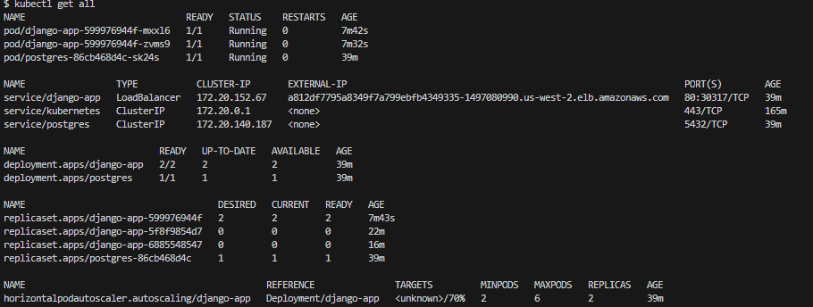
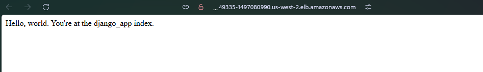

**Структура проєкту**


**Необхідні пакети:**
- AWS CLI
- Terraform
- kubectl
- Helm
- Docker


**Команди для ініціалізації та запуску:**

1. **Підготовка інфраструктури**

```
git clone https://github.com/didukhroma/my-microservice-project.git

cd my-microservice-project

# Ініціалізація Terraform
terraform init

# Перевірка плану змін
terraform plan

# Створення інфраструктури
terraform apply

```
2. **Налаштування Kubernetes**

```
# Підключення до EKS-кластеру
aws eks update-kubeconfig --region us-west-2 --name lesson-7-eks-cluster

# Перевірка нод
kubectl get nodes
```

3. **Підготовка Docker-образу**
```
# Перехід в Django-проєкт
cd ./docker/django_app

# Збірка образу 
docker build --no-cache -t lesson-7-django-app .

# Логін у ECR
aws ecr get-login-password --region us-west-2 \
  | docker login --username AWS --password-stdin ACCOUNT_ID.dkr.ecr.us-west-2.amazonaws.com

# Додавання тегу
docker tag lesson-7-django-app:latest ACCOUNT_ID.dkr.ecr.us-west-2.amazonaws.com/lesson-7-django-app:latest

# Завантаження
docker push ACCOUNT_ID.dkr.ecr.us-west-2.amazonaws.com/lesson-7-django-app:latest
```
4. **Helm**
```
#Перехід в корінь проекту
cd ../../

# Встановлення Helm
helm install django-app ./charts/django-app

# Перевірка статусу
helm status django-app
kubectl get all
```


5. **Доступ до застосунку**
```
# Отримання зовнішнього IP 
kubectl get service django-app
```

Робоча сторінка


