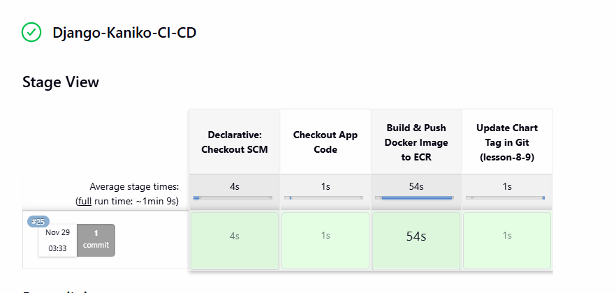
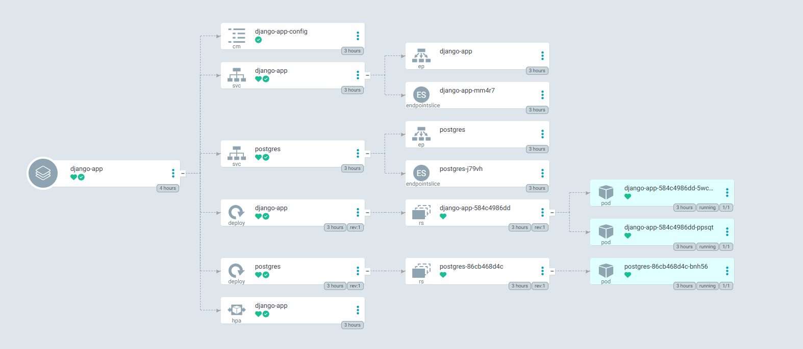

# CI/CD-процес із використанням Jenkins + Helm + Terraform + Argo CD, який:

1. Автоматично збирає Docker-образ для Django-застосунку;

2. Публікує образ в Amazon ECR;

3. Оновлює Helm chart у репозиторії з правильним тегом;

4. Синхронізує застосунок у кластері через Argo CD, який підхоплює зміни з Git.

**Структура проєкту**
```
Progect/
│
├── main.tf                  # Головний файл для підключення модулів
├── backend.tf               # Налаштування бекенду для стейтів (S3 + DynamoDB
├── outputs.tf               # Загальні виводи ресурсів
│
├── modules/                 # Каталог з усіма модулями
│   ├── s3-backend/          # Модуль для S3 та DynamoDB
│   │   ├── s3.tf            # Створення S3-бакета
│   │   ├── dynamodb.tf      # Створення DynamoDB
│   │   ├── variables.tf     # Змінні для S3
│   │   └── outputs.tf       # Виведення інформації про S3 та DynamoDB
│   │
│   ├── vpc/                 # Модуль для VPC
│   │   ├── vpc.tf           # Створення VPC, підмереж, Internet Gateway
│   │   ├── routes.tf        # Налаштування маршрутизації
│   │   ├── variables.tf     # Змінні для VPC
│   │   └── outputs.tf  
│   ├── ecr/                 # Модуль для ECR
│   │   ├── ecr.tf           # Створення ECR репозиторію
│   │   ├── variables.tf     # Змінні для ECR
│   │   └── outputs.tf       # Виведення URL репозиторію
│   │
│   ├── eks/                      # Модуль для Kubernetes кластера
│   │   ├── eks.tf                # Створення кластера
│   │   ├── aws_ebs_csi_driver.tf # Встановлення плагіну csi drive
│   │   ├── variables.tf     # Змінні для EKS
│   │   └── outputs.tf       # Виведення інформації про кластер
│   │
│   ├── jenkins/             # Модуль для Helm-установки Jenkins
│   │   ├── jenkins.tf       # Helm release для Jenkins
│   │   ├── variables.tf     # Змінні (ресурси, креденшели, values)
│   │   ├── providers.tf     # Оголошення провайдерів
│   │   ├── values.yaml      # Конфігурація jenkins
│   │   └── outputs.tf       # Виводи (URL, пароль адміністратора)
│   │ 
│   └── argo_cd/             # ✅ Новий модуль для Helm-установки Argo CD
│       ├── jenkins.tf       # Helm release для Jenkins
│       ├── variables.tf     # Змінні (версія чарта, namespace, repo URL тощо)
│       ├── providers.tf     # Kubernetes+Helm.  переносимо з модуля jenkins
│       ├── values.yaml      # Кастомна конфігурація Argo CD
│       ├── outputs.tf       # Виводи (hostname, initial admin password)
│		    └──charts/                  # Helm-чарт для створення app'ів
│ 	 	    ├── Chart.yaml
│	  	    ├── values.yaml          # Список applications, repositories
│			    └── templates/
│		        ├── application.yaml
│		        └── repository.yaml
├── charts/
│   └── django-app/
│       ├── templates/
│       │   ├── deployment.yaml
│       │   ├── service.yaml
│       │   ├── configmap.yaml
│       │   └── hpa.yaml
│       ├── Chart.yaml
│       └── values.yaml     # ConfigMap зі змінними середовища

```


**Необхідні пакети:**
- AWS CLI
- Terraform
- kubectl
- Helm
- Docker
- Git


**Команди для ініціалізації та запуску:**

1. ***Підготовка доступу**

```
# Налаштуйте AWS CLI
aws configure

Підготовка AWS Credentials
# Отримайте ваш AWS Account ID
AWS_ACCOUNT_ID=$(aws sts get-caller-identity --query Account --output text)
echo "AWS Account ID: $AWS_ACCOUNT_ID"

```
Підготовка секретів
```
# Кодування AWS credentials в base64
echo -n "YOUR_AWS_ACCESS_KEY_ID" | base64
echo -n "YOUR_AWS_SECRET_ACCESS_KEY" | base64

# Створіть GitHub Personal Access Token і закодуйте
echo -n "YOUR_GITHUB_TOKEN" | base64
```

Оновіть файл secrets.yaml вашими закодованими значеннями:
```
apiVersion: v1
kind: Secret
metadata:
  name: aws-credentials
  namespace: jenkins
type: Opaque
data:
  aws-access-key-id: <BASE64_ENCODED_ACCESS_KEY>
  aws-secret-access-key: <BASE64_ENCODED_SECRET_KEY>
---
apiVersion: v1
kind: Secret
metadata:
  name: github-token
  namespace: jenkins
type: Opaque
data:
  token: <BASE64_ENCODED_GITHUB_TOKEN>
```

2. **Розгортання інфраструктури** 
```
# Ініціалізація Terraform
terraform init

# Перегляд планованих змін
terraform plan

# Розгортання інфраструктури (15–20 хвилин)
terraform apply
```

3. **Налаштування CI/CD Pipeline**

```# Отримання URLs та паролів
terraform output deployment_instructions
```
```
# Отримання паролів окремо
terraform output jenkins_admin_password
terraform output argocd_admin_password
```

Логін в Jenkins:

```
Username: admin
Password: terraform output jenkins_admin_password
Створення Pipeline Job:

New Item → Pipeline
Pipeline script from SCM
Git Repository: https://github.com/didukhroma/my-microservice-project.git
Branch: dev
Script Path: Jenkinsfile
Налаштування Credentials:

Manage Jenkins → Credentials
Додайте GitHub token з ID: github-token
```
Налаштування Argo CD
Доступ до Argo CD UI:

Отримати URL Argo CD
```
terraform output argocd_server_url
Логін в Argo CD:

Username: admin
Password: terraform output argocd_admin_password
Перевірка Applications:

Argo CD автоматично створить Application для Django
Перевірте статус синхронізації
```

3. **Процес CI/CD**

*Continuous Integration (Jenkins)*\
Тригер: Push у гілку dev \
Збірка: Kaniko збирає Docker-образ з Django-кодом \
Публікація: Образ публікується в ECR з тегом build number \
Оновлення: Jenkins оновлює values.yaml у гілці lesson-8-9 \
Commit: Зміни комітяться назад у Git-репозиторій \

*Continuous Deployment (Argo CD)* \
Моніторинг: Argo CD відстежує зміни в гілці lesson-8-9 \
Синхронізація: Автоматично застосовує зміни в Kubernetes \
Деплой: Новий Docker-образ розгортається в кластері \
Масштабування: HPA автоматично масштабує поди за навантаженням \



