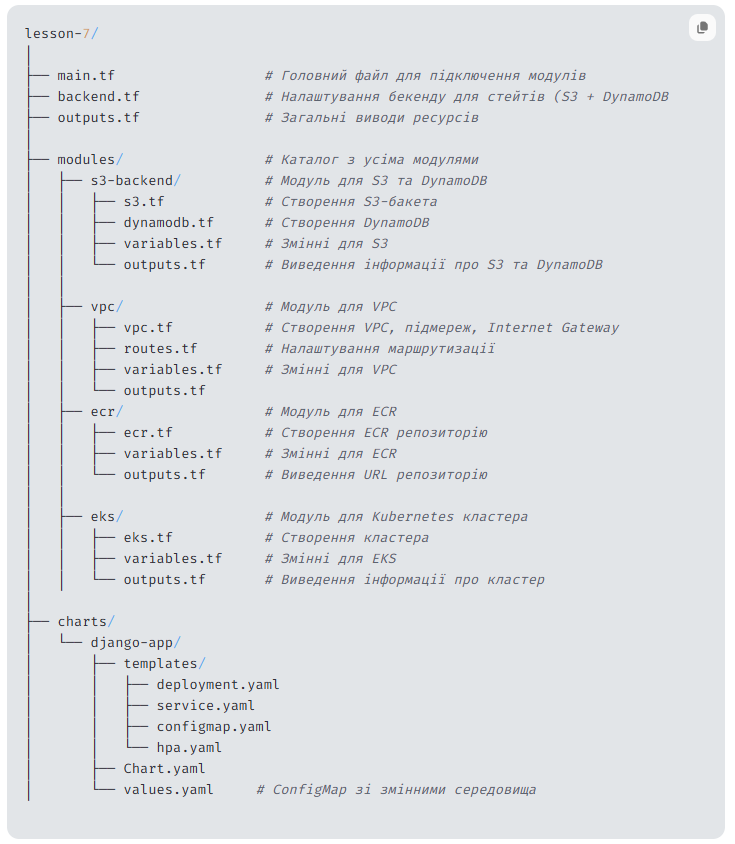

Структура проєкту



Команди для ініціалізації та запуску:

```
Created base structure without backend

Rename backend.tf -> backend.tf.off
terraform init
terraform plan
terraform apply

Created backend

Rename backend.tf.off -> backend.tf
terraform init

For delete structure
terraform destroy

```

Пояснення кожного модуля:

S3-backend

Відповідає за синхронізацію стейт-файлів у S3 з використанням DynamoDB для блокування.

VPC

Відповідає за мережеву інфраструктуру (VPC) з публічними та приватними підмережами.

ECR

ECR (Elastic Container Registry) використовується для зберігання Docker-образів.
